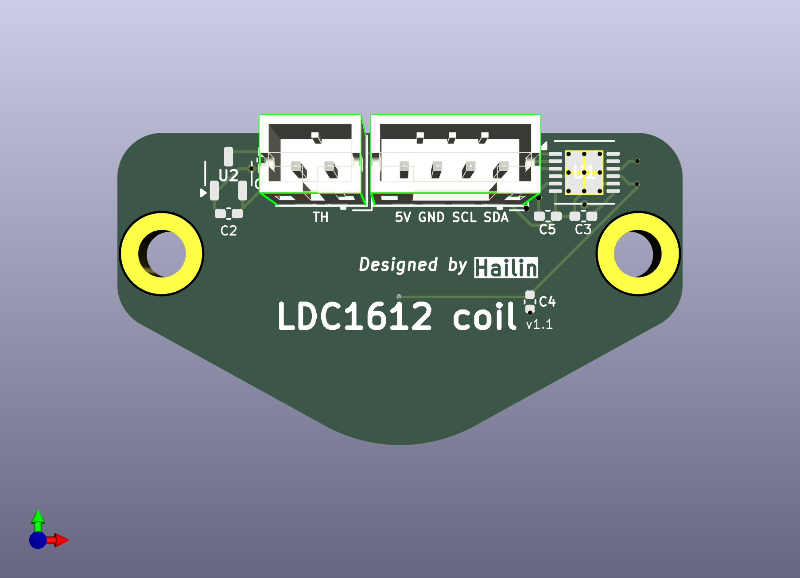
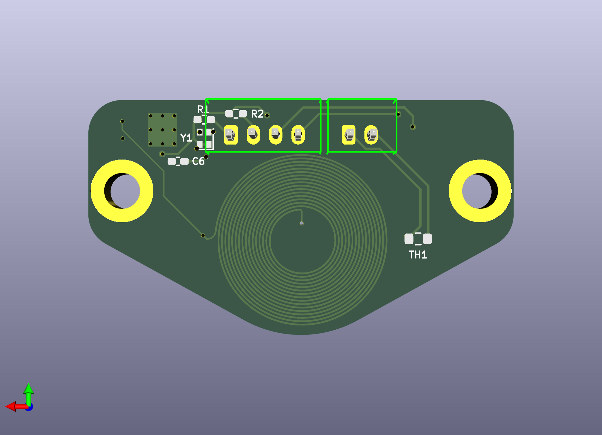

# LDC1612 Beacon coil

A surface scanner for Klipper firmware [Eddy current probe](https://www.klipper3d.org/Eddy_Probe.html?h=eddy#eddy-current-inductive-probe) to provide very fast and high accuracy surface scanning.

## Features

* Similar to [Beacon revH](https://beacon3d.com/product/beacon-h/), but open source.
* Simple, no microcontroller, only LDC1612 chip inside.
* Connection stable, only support I2C connecting, but it is stable than via USB or CAN through an another MCU.
* Has an NTC thermistor to support coil temparature detect.

## How to use

This is a Kicad project, if you want to modify this project, you need to clone it, then download and install [Kicad](https://www.kicad.org/download/) to open.

